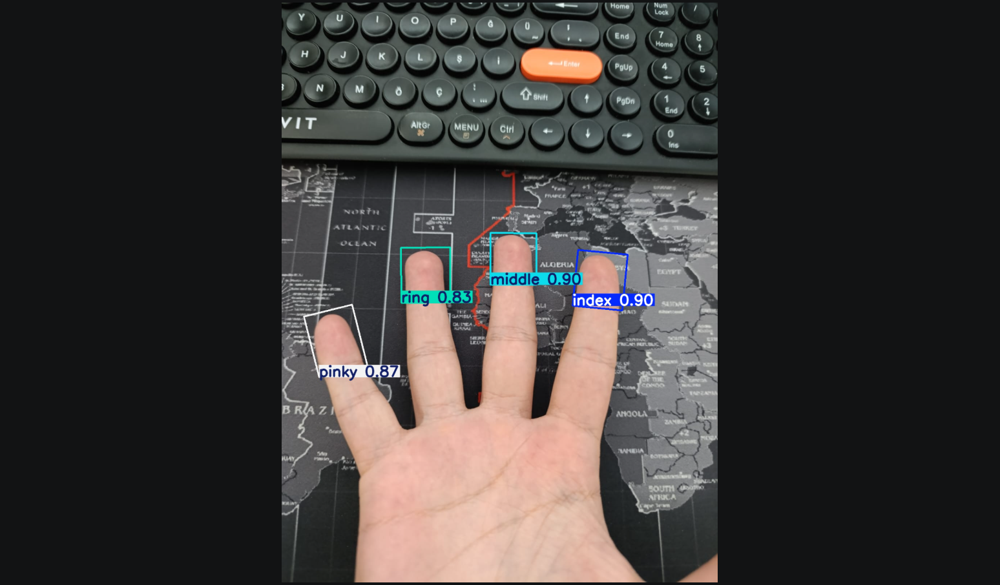
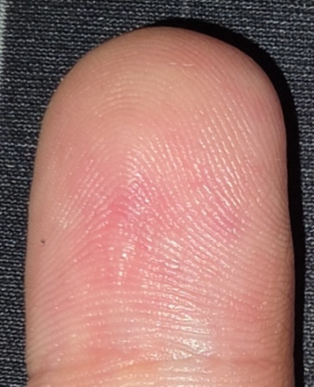
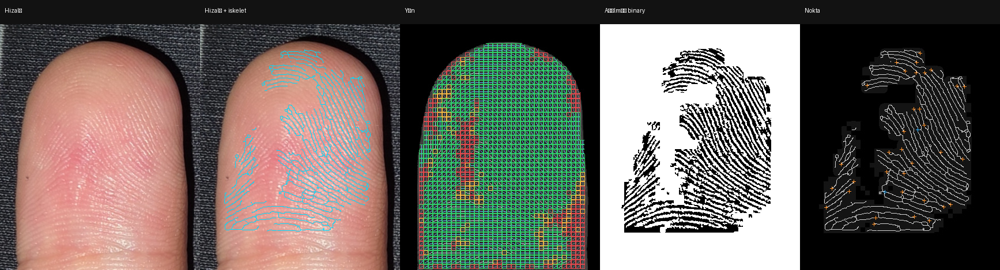

# Temassız Parmak İzi Kalite Analizi

Telefon kamerasından temassız parmak ucu görüntüsü alan, görüntüyü kanonik ROI’ye hizalayan, ridge/minutiae kalite analizi yapan ve aynı cihaz üzerinde yerel 1:N parmak izi tanıma prototipi sunan Expo SDK 57 uygulaması.

> **Durum:** Araştırma ve demo prototipidir. Liveness/PAD içermez, sertifikalı AFIS veya ISO/IEC 19794-2 uyumlu üretim sistemi değildir. Gerçek erişim kontrolü ve yüksek güvenlikli kimlik doğrulama için kullanılmamalıdır.

## İçindekiler

- [Öne çıkan akış](#öne-çıkan-akış)
- [Uygulama görüntüleri](#uygulama-görüntüleri)
- [Teknik mimari](#teknik-mimari)
- [Gereksinimler](#gereksinimler)
- [Temiz kurulum](#temiz-kurulum)
- [Model dosyalarını yerleştirme](#model-dosyalarını-yerleştirme)
- [Development Build ile Android’de çalıştırma](#development-build-ile-androidde-çalıştırma)
- [Kamera ve işlem akışı](#kamera-ve-işlem-akışı)
- [Kalite ve debug çıktıları](#kalite-ve-debug-çıktıları)
- [Yerel enrollment ve eşleştirme](#yerel-enrollment-ve-eşleştirme)
- [Testler](#testler)
- [Model eğitimi ve veri hazırlama](#model-eğitimi-ve-veri-hazırlama)
- [Klasör yapısı](#klasör-yapısı)
- [Sorun giderme](#sorun-giderme)
- [Gizlilik, veri ve Git politikası](#gizlilik-veri-ve-git-politikası)
- [Sınırlamalar ve sonraki çalışmalar](#sınırlamalar-ve-sonraki-çalışmalar)

## Öne çıkan akış

Uygulama dört parmak konumunu işler: `index`, `middle`, `ring` ve `pinky`.

```mermaid
flowchart LR
    A[Kamera fotoğrafı] --> B[EXIF yönünü normalize et]
    B --> C[YOLO OBB: parmak ucu tespiti]
    C --> D[ROI ve homografi]
    D --> E[Kanonik hizalı ROI]
    E --> F[Segmentation maskesi]
    F --> G[Yön + ridge period]
    G --> H[Ridge enhancement]
    H --> I[Binary + thinning]
    I --> J[Topoloji filtreleri]
    J --> K[Minutiae template]
    K --> L[Kalite raporu]
    L --> M[Enrollment veya 1:N eşleştirme]
```



Özetle:

1. Canlı kamera ekranında OBB kutuları gösterilir.
2. Fotoğraf çekildiğinde dört parmak için ROI oluşturulur.
3. OBB köşeleri kanonik koordinat sistemine taşınır; aynı koordinat çerçevesi segmentation, ridge ve minutiae çıktılarında korunur.
4. Kalite yeterliyse parmak ridge’leri işlenir ve minutiae noktaları çıkarılır.
5. Yeni kişi kaydında üç geçerli çekimden şablon oluşturulur.
6. Tanıma modunda gelen parmaklar yalnızca aynı parmak konumundaki kayıtlarla karşılaştırılır.

## Uygulama görüntüleri

Canlı aşamada model, görüntüdeki dört parmak ucunu sınıf ve güven değeriyle birlikte OBB olarak işaretler:



Fotoğraf işleminden sonra parmak ucu, kamera görüntüsünden ayrılarak kanonik bir ROI’ye taşınır. Bu örnek, uygulamadaki **Hizalı** çıktının fiziksel anlamını gösterir:



Hizalı ROI üzerinde uygulamadaki tek dokunuşla açılıp kapanan iskelet katmanı, yön güven haritası ve minutiae çıktısı birlikte kontrol edilebilir:



Bu görseller proje sahibine ait, kamuya açık paylaşımı onaylanmış örneklerdir. Üretim veritabanı, kişi kayıtları ve başkalarına ait test görüntüleri depoya eklenmez.

## Teknik mimari

### Mobil katman

- Expo SDK 57
- React Native 0.86
- Expo Router
- `react-native-vision-camera`
- `onnxruntime-react-native`
- `react-native-worklets` ve Vision Camera worklets
- `react-native-reanimated`
- `expo-secure-store`
- `expo-file-system`

### Görüntü işleme katmanı

- YOLO OBB: canlı ve fotoğraf üzerinde parmak ucu konumlandırma
- Homografi tabanlı kanonik ROI hizalama
- Tek sınıflı distal parmak segmentation modeli
- Maskeli grayscale normalizasyonu ve kontrast iyileştirme
- Ridge orientation ve ridge period analizi
- Çok ölçekli ridge enhancement/Gabor desteği
- Adaptif binary ridge haritası
- Thinning/skeletonization
- Yön güveni, maske sınırı, kısa dal ve topoloji filtreleri
- Ridge ending ve bifurcation minutiae çıkarımı
- Kalite skoru ve eşik tabanlı biyometrik yeterlilik

### Yerel biyometrik katman

Şablonlar uygulamanın yerel dosya alanında şifreli tutulur. Şifreleme anahtarı cihazın `SecureStore` alanında saklanır. Ham fotoğraflar biyometrik veritabanına kopyalanmaz; kayıtlar kaynak capture ID’si, kalite özeti ve minutiae tabanlı şablon içerir.

Mevcut tanıma prototipi:

- Aynı parmak konumlarını karşılaştırır.
- Ending yalnızca ending, bifurcation yalnızca bifurcation ile eşleşir.
- İki noktalı geometri hipotezleri ve similarity dönüşümü kullanır.
- Dönüşmüş noktalarda greedy/graph destekli inlier değerlendirmesi yapar.
- Matched minutiae, güven, kapsama ve graph/texture kanıtlarını birlikte raporlar.
- Düşük kalite, yakın skor veya çelişkili kanıt durumunda kabul etmez.

## Gereksinimler

### Mobil geliştirme

- Windows, macOS veya Linux
- Node.js `22.13.x` veya üzeri
- Android Studio ve Android SDK
- Android SDK Platform Tools (`adb`)
- Java/Gradle kurulumu
- Fiziksel Android cihaz veya uygun emulator
- Kamera erişimi olan bir Development Build

Expo SDK 57’nin resmi sürüm dokümantasyonu: [docs.expo.dev/versions/v57.0.0](https://docs.expo.dev/versions/v57.0.0/)

### Model eğitimi

Mobil uygulamayı çalıştırmak için Python GPU ortamı gerekmez. Model eğitimi ve veri hazırlama için ayrıca Python 3.12, `uv` veya sanal ortam yöneticisi, NVIDIA CUDA destekli PyTorch, Ultralytics ve ONNX/ONNX Runtime GPU gerekir.

RTX 4060 için kullanılan bağımlılık listesi [YOLO/requirements-gpu.txt](YOLO/requirements-gpu.txt) içindedir.

## Temiz kurulum

```powershell
git clone https://github.com/EnesSoydan/temassiz-parmak-izi-kalite-analizi.git
cd temassiz-parmak-izi-kalite-analizi
npm.cmd ci
```

PowerShell’de `npm` veya `npx` bulunamazsa Windows karşılıklarını kullanın:

```powershell
npm.cmd ci
npx.cmd expo --version
```

İlk çalıştırmadan önce model dosyaları [Model dosyalarını yerleştirme](#model-dosyalarını-yerleştirme) bölümündeki konuma kopyalanmalıdır.

## Model dosyalarını yerleştirme

Model ağırlıkları boyutları ve veri sahipliği nedeniyle GitHub’a dahil edilmez. Uygulama build’i için şu iki dosya yerel olarak bulunmalıdır:

```text
assets/models/fingertip_obb.onnx
assets/models/fingertip_segmentation.onnx
```

Dosya adları `app.json` ve [src/lib/onnx-model.ts](src/lib/onnx-model.ts) ile birebir eşleşmelidir. Ayrıntılı notlar: [assets/models/README.md](assets/models/README.md)

Modeli GitHub Releases, Git LFS veya erişimi kısıtlı ayrı bir model deposundan dağıtabilirsiniz. Model dosyalarını normal Git commit’ine eklemeyin.

## Development Build ile Android’de çalıştırma

### USB ile

Android cihazda Geliştirici seçenekleri ve USB hata ayıklama açık olmalıdır.

```powershell
$env:Path += ";$env:LOCALAPPDATA\Android\Sdk\platform-tools"
adb devices
npx.cmd expo run:android --device
```

`adb devices` çıktısında cihazın yanında `device` yazmalıdır. `offline` veya boş liste varsa bağlantı kurulmamıştır.

### Kablosuz ADB ile

Önce cihazı ve bilgisayarı aynı ağa bağlayın:

```powershell
$env:Path += ";$env:LOCALAPPDATA\Android\Sdk\platform-tools"
adb pair <telefon-ip>:<pairing-port>
adb connect <telefon-ip>:<connect-port>
adb devices
```

`pair` portu ile `connect` portu aynı olmak zorunda değildir. Android’in Kablosuz hata ayıklama ekranında o anda gösterilen portları kullanın.

### Metro sunucusu

Development Build kurulduktan sonra Metro’yu ayrı bir terminalde çalıştırın:

```powershell
npx.cmd expo start --dev-client --lan
```

Önbellek bozulması veya eski bundle kullanımı şüphesinde:

```powershell
npx.cmd expo start --dev-client --lan --clear
```

Port 8081 kullanımdaysa farklı bir port seçilebilir; telefon ve bilgisayarın aynı ağa erişebildiğinden emin olun.

## Kamera ve işlem akışı

### 1. Canlı tespit

Vision Camera’dan gelen frame, cihaz üzerinde OBB ONNX modeline verilir. Model dört sınıf üretir: `index`, `middle`, `ring`, `pinky`. Canlı kutular kullanıcıya parmağın yaklaşık konumunu gösterir; canlı aşamadaki kutular doğrudan biyometrik şablon üretmez.

### 2. Fotoğraf ve yön

Fotoğrafın EXIF yönü normalize edilir. Böylece kaynak görüntü, OBB koordinatları ve görüntü pikselleri aynı fiziksel yönü kullanır. Flaşlı görüntü, kalite kapısı geçildiğinde ROI hattına girer.

### 3. ROI ve kanonik hizalama

OBB’nin dört köşesi sıralanır ve kanonik dikdörtgen koordinatlarına homografi ile taşınır. Bu dönüşüm görüntüye, segmentation maskesine, yön alanına, ridge çıktısına ve minutiae koordinatlarına aynı koordinat çerçevesiyle uygulanır. Böylece **Hizalı**, **Seg**, **Yön**, **Ridge**, **Binary** ve **Nokta** çıktıları aynı fiziksel parmak bölgesini temsil eder.

### 4. Segmentation

Segmentation modeli OBB’den gelen ROI içinde distal parmak alanını tek sınıflı maske olarak tahmin eder. Maske, arka planı ve güvenilmez sınır piksellerini ridge hattından ayırmak için kullanılır. `coverage` değeri yalnızca maskenin piksel oranıdır; tek başına parmağın doğru ayrıldığını kanıtlamaz.

### 5. Ridge ve yön

Kanonik ROI üzerinde grayscale normalizasyonu, ridge polarity kontrolü, orientation ve ridge period analizi yapılır. Yön güveni düşük bloklarda sahte ridge üretilmemesi için enhancement ve skeleton çıktısı kısıtlanır.

### 6. Binary, skeleton ve minutiae

Ridge görüntüsü gri tonlu ve iyileştirilmiş bir görüntüdür. Binary görüntü ridge/valley ayrımının eşiklenmiş hâlidir. Binary görüntü thinning işleminden geçirilerek tek piksel kalınlığında skeleton elde edilir. Skeleton üzerindeki topolojik adaylar branch tracing, kısa dal, sınır, yön ve yerel halka kontrollerinden sonra ridge ending veya bifurcation olarak minutiae şablonuna alınır.

## Kalite ve debug çıktıları

Uygulamadaki ROI galerisi işlem hattının farklı aşamalarını gösterir:

| Çıktı | Anlamı |
|---|---|
| Flaşlı | Kalite kontrolünden geçen kaynak fotoğraf |
| Hizalı | OBB/homografi sonrası kanonik ROI |
| Seg | Distal parmak segmentation maskesi/önizlemesi |
| Yön | Ridge orientation ve blok güven haritası |
| Ridge | Enhancement sonrası ridge görüntüsü |
| Binary | Eşiklenmiş ridge haritası |
| Nokta | Skeleton ve kabul edilen minutiae işaretleri |

**Hizalı** görüntüsüne dokunulduğunda iskelet katmanı açılıp kapanır. İki parmakla yakınlaştırma/uzaklaştırma ve yakın görünümde sürükleme desteklenir. Bu debug etkileşimi skeleton çizgilerinin gerçek ridge konumlarıyla aynı olup olmadığını görsel olarak incelemek içindir.

Kalite loglarında özellikle şu metrikler takip edilir:

- `foreground mask area`
- `orientation reliable block ratio`
- `Gabor supported area`
- `valid ridge block ratio`
- skeleton piksel sayısı
- crossing-number adayları
- branch validation sonrası adaylar
- suppression sonrası ending/bifurcation sayıları
- ridge period histogramı
- minutiae confidence dağılımı

## Yerel enrollment ve eşleştirme

### Yeni kişi kaydı

1. Kamera ekranında **Yeni kişi kaydet** modu seçilir.
2. Kullanıcı adı girilir.
3. Üç geçerli el çekimi alınır.
4. Her çekimde `index`, `middle`, `ring`, `pinky` için geçerli kalite ve minutiae şablonu aranır.
5. Gerekli parmaklar tamamlanınca kişi ve şablonlar yerel şifreli veritabanına yazılır.

Eksik veya yetersiz parmak varsa kayıt yarım kişi olarak eklenmez. Ham fotoğraflar biyometrik veritabanına kopyalanmaz; capture geçmişi ayrı tutulur.

### Tanıma

1. Kamera görüntüsü aynı ROI/minutiae hattından geçirilir.
2. Gelen `index`, kayıtlı `index` şablonlarıyla; diğer parmaklar da kendi konumlarıyla karşılaştırılır.
3. Her aday kişi için parmak bazlı skorlar hesaplanır.
4. En iyi kişi skoru, eşik, kapsama ve çelişki kurallarıyla değerlendirilir.
5. Sonuç `Hoş geldiniz`, `Eşleşme bulunamadı`, `Kalite yetersiz` veya `Belirsiz` olarak gösterilir.

Tek güçlü parmakla kabul demo kuralı olarak desteklenebilir; bu güvenlik açısından zayıftır. Liveness olmadığı için fotoğraf veya video saldırılarına karşı koruma yoktur.

### Veritabanı sıfırlama

Kayıtlar ekranındaki silme ve tümünü sıfırlama işlemleri biyometrik kayıtları geri alınamaz biçimde kaldırır. Geliştirme sırasında gerçek kişilere ait kayıtları paylaşmadan önce cihaz depolamasını temizleyin.

## Testler

TypeScript ve lint:

```powershell
npx.cmd tsc --noEmit
npm.cmd run lint
```

Görüntü işleme ve kalite testleri:

```powershell
npm.cmd run test:roi
npm.cmd run test:ridge
npm.cmd run test:ridge-scale
npm.cmd run test:clahe
npm.cmd run test:minutiae
npm.cmd run test:png
npm.cmd run test:seg-preview
```

Matcher, değerlendirme ve canlı kalite testleri:

```powershell
npm.cmd run test:matcher
npm.cmd run test:evaluation
npm.cmd run test:live-quality
npm.cmd run test:tracking
```

Android manuel testlerinde en az şu senaryoları kontrol edin:

- normal, yakın, uzak ve hafif açılı çekim
- flaş yansıması ve düşük ışık
- serçe parmak eksikliği
- EXIF yönü ve ekran yönü
- segmentation maskesi ile gerçek parmak örtüşmesi
- hizalı ROI üzerinde skeleton katmanı
- aynı kişi genuine probe
- farklı el/impostor probe
- bozuk veya eksik model dosyası
- kablosuz ADB kopması

## Model eğitimi ve veri hazırlama

Model ve veri depoya dahil değildir. Yerel çalışma alanındaki beklenen paketler:

```text
YOLO/datasets/merged_hands_fingertip_obb/
YOLO/segmentation_data/yolo-sam2-review-1500/
```

OBB veri seti dört sınıflıdır: `index`, `middle`, `ring`, `pinky`. Segmentation eğitim paketi ise distal parmak sınırı için tek sınıflı `finger` formatındadır.

Başlıca scriptler:

| Script | Görev |
|---|---|
| `YOLO/scripts/training.py` | OBB eğitim ve export yardımcıları |
| `YOLO/scripts/val.py` | Parametreli OBB validation |
| `YOLO/scripts/dataset_analiz.py` | Dataset dağılımı ve kalite analizi |
| `YOLO/scripts/obb_to_polygon_masks.py` | OBB sonuçlarından polygon başlangıcı |
| `YOLO/scripts/sam2_box_prompt_segmentation.py` | OBB kutularını SAM2 box prompt olarak kullanma |
| `YOLO/scripts/export_yolo_segmentation_review.py` | Polygonları YOLO segmentation formatına aktarma |
| `YOLO/scripts/polygons_to_png_masks.py` | Polygonlardan PNG maske üretme |
| `YOLO/scripts/build_segmentation_manifest.py` | Train/validation manifest üretme |
| `YOLO/scripts/training_segmentation.py` | Tek sınıflı segmentation eğitimi ve ONNX export |
| `YOLO/scripts/convert_onnx.py` | Model export/dönüşüm yardımcıları |

Yeni makinede dataset yollarını sabit kullanıcı klasörlerine bağlamak yerine script parametreleriyle verin. `YOLO/scripts/val.py` proje içindeki varsayılan yolu kullanır; farklı bir dataset için `--data` ve gerekirse `--model` belirtilebilir.

Örnek:

```powershell
python YOLO/scripts/val.py `
  --model runs/fingertip_obb/robust_illumination_rotation_obb/weights/best.pt `
  --data YOLO/datasets/merged_hands_fingertip_obb/data.yaml `
  --imgsz 480
```

GPU kurulumu için `YOLO/requirements-gpu.txt` içindeki PyTorch/CUDA sürümlerini ekran kartınıza göre doğrulayın. Eğitim çıktıları, checkpoint’ler ve datasetler Git’e eklenmemelidir.

## Klasör yapısı

```text
.
├─ src/
│  ├─ app/                  # Kamera ve kayıt ekranları
│  ├─ components/           # Ortak React Native bileşenleri
│  ├─ lib/                  # ROI, segmentation, ridge, minutiae, matcher
│  └─ types/                # Biyometri ve görüntü veri tipleri
├─ scripts/                 # Mobil pipeline testleri ve cihaz yardımcıları
├─ YOLO/scripts/            # Eğitim, veri hazırlama ve ONNX export
├─ assets/images/           # Uygulama ikonları ve splash görselleri
├─ assets/models/           # Yerel ONNX model yuvası; ağırlıklar hariç
├─ docs/images/             # README’de kullanılan seçilmiş görseller
├─ patches/                 # Native dependency patch’leri
├─ app.json                 # Expo ve native plugin yapılandırması
├─ package.json             # Bağımlılıklar ve test komutları
└─ .gitignore               # Veri, model, build ve kişisel çıktı politikası
```

## Sorun giderme

### `adb` bulunamıyor

PowerShell oturumunda Android Platform Tools yolunu ekleyin:

```powershell
$env:Path += ";$env:LOCALAPPDATA\Android\Sdk\platform-tools"
adb devices
```

Kalıcı PATH ayarı yapmak istemiyorsanız her yeni terminalde bu satırı çalıştırmanız gerekir.

### `adb devices` boş veya `offline`

Telefonda USB hata ayıklama iznini onaylayın. Kablosuz bağlantıda Android ayarlarında o anda gösterilen pairing/connect portlarını kullanın:

```powershell
adb kill-server
adb start-server
adb connect <telefon-ip>:<connect-port>
adb devices
```

### Metro önbelleği hatası

```powershell
npx.cmd expo start --dev-client --lan --clear
```

### Model bulunamadı

```powershell
Get-ChildItem assets/models
```

Beklenen dosyalar `fingertip_obb.onnx` ve `fingertip_segmentation.onnx` olmalıdır. Model değiştiyse native asset’in build içine yeniden gömülmesi için Development Build’i yeniden oluşturun.

### Worklets veya canlı frame hatası

Bu proje native Development Build kullandığı için JavaScript bundle’ını yenilemek tek başına yeterli olmayabilir. Bağımlılık veya native plugin değişikliğinden sonra:

```powershell
npm.cmd ci
npx.cmd expo run:android --device
npx.cmd expo start --dev-client --lan --clear
```

### `git diff` ekranında `:` işareti

Git uzun çıktıyı `less` içinde açmıştır. Çıkmak için `q`, işlemi kesmek için `Ctrl+C` basın. Uzun çıktıları doğrudan terminale yazdırmak için:

```powershell
git --no-pager diff --stat
```

## Gizlilik, veri ve Git politikası

Bu proje parmak izi benzeri biyometrik veriler işlediği için aşağıdaki dosyalar kaynak kod deposuna alınmaz:

- kişi kayıtları ve şifreli biyometrik veritabanı
- telefon capture geçmişi ve ROI görüntüleri
- test fotoğrafları ve debug export’ları
- OBB/segmentation datasetleri ve PNG maskeler
- `.pt`, `.pth`, `.onnx`, `.ckpt` ve benzeri model ağırlıkları
- `runs/`, eğitim logları ve validation çıktıları
- `node_modules/`, Android build çıktıları ve sanal ortamlar
- API anahtarları, sertifikalar ve yerel konfigürasyonlar

README’deki görseller proje sahibine ait, paylaşımı onaylanmış örneklerdir. Başkalarına ait biyometrik görüntüler herkese açık bir repository’ye eklenmeden önce açık izin ve veri sahipliği kontrolü yapılmalıdır.

## Sınırlamalar ve sonraki çalışmalar

- İlk hedef aynı cihazda ve aynı kamera koşullarında çalışan temassız demo akışıdır.
- Tek görüntü enrollment ve sınırlı kişi sayısı genelleme için yeterli değildir.
- Liveness/PAD olmadığı için sunum ve güvenlik iddiası sınırlı tutulmalıdır.
- Eşikler geniş, dengeli genuine/impostor pilot veri setiyle yeniden kalibre edilmelidir.
- Daha güvenilir sonuç için kişi başına daha fazla enrollment örneği, farklı cihaz/ışık koşulları ve graph/RANSAC matcher doğrulaması gerekir.
- Öğrenilmiş segmentation ve texture embedding modelleri, yeterli ve kişi ayrımı korunmuş veri seti oluşturulduktan sonra değerlendirilmelidir.

## Lisans

Kod lisans bilgisi [LICENSE](LICENSE) dosyasındadır. Veri setleri, model ağırlıkları, kişisel görüntüler ve üçüncü taraf materyaller farklı lisans/izin koşullarına tabi olabilir.
